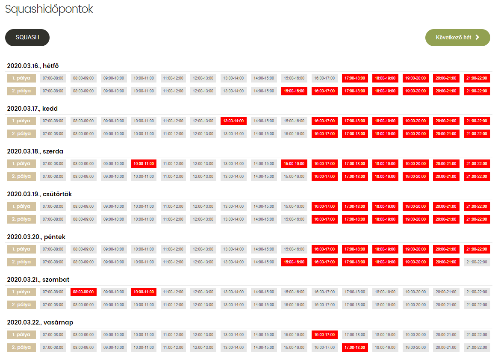
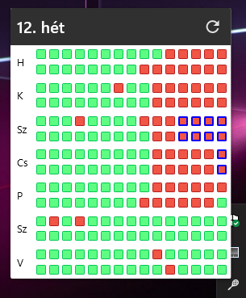

# Mr Squash Watcher
Famulus squash idõpontok foglaltságát figyelõ alkalmazás.
Ha egy pálya felszabadul a beállított idõpontokban, küld egy Windows értesítést.

Letöltés [innen](https://github.com/kodaniel/MrSquashWatcher/releases).

